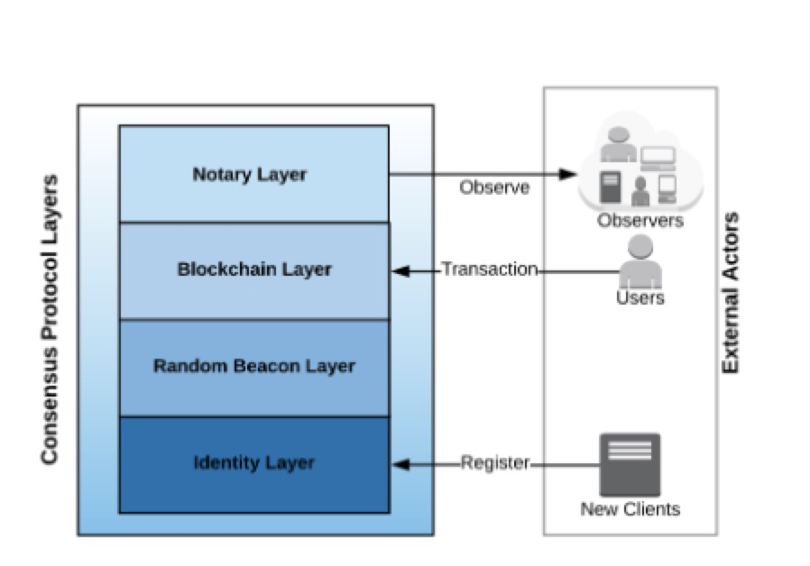

# DFINITY --- The Internet Computer

##1. 基本信息
|twitter|reddit|telegram|medium|团队人数|
|---|---|---|---|---|---|---|---|
|27k|5.4k|44k|4.9k|30|

区块情况

|区块确认|出块时间|gas可用计算|
|---|---|---|
|2|5-10s|125-250M|

目的打造一个去中心化云计算平台，拥有无限扩展性，安全高效的区块链项目。

##2. 技术特点

2.1 **共识协议**

* 经注册的身份认证： 永久匿名
* 去中心化随机数： VRF可验证机制 + 阀值签名方案(BLS)
* 随机数驱动的区块链: 概率插槽协议，每个块高度对客户端进行排序，排序高的权重高。 分叉问题可以通过拥有最重累计权重的链条得到解决。
* 公证机制: 区块提议，乐观共识

2.2 智能管理：区块链神经系统。客户端可以参与进来，作为一个神经元节点。需要质押DFN, 同时也可以获得回报。

2.3 用户至上：支持交易回滚，自修复错误。

2.4 快速迭代升级， 自适应网络

2.5 多网络系统：私有网络可以连接到公共网络上

2.6 DF可以允许公共链提供的服务，通过产生区块的形式被私链使用

##3. 经济模型

1. 身份认证注册需要质押保证金 DFN
2. 参与智能管理，质押和回报。作为网络上特定的身份参与贡献，从而获得回报
2. 矿机+DFN
3. 安装节点软件（挖坑软件）需要DFN
4. 支付Dfinity计算，存储服务
5. 参与治理，作为网络的神经元

##4. 评价

* 人气很高，技术实现有一定难度
* 无限扩容，效率远高于以太坊
* AI化管理，

