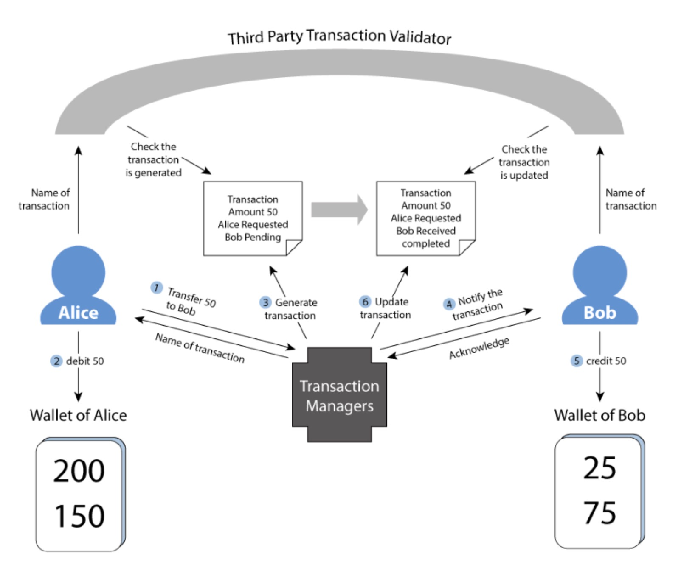

#Maidsafe

###1.近况

2018-05-25 发布了新的共识算法， Alpha2版本上线

PARSEC(Protocol for Asynchronous, Reliable, Secure and Efficient Consensus)

主要是解决分布式计算网络的问题，如拜占庭容错， 交易顺序， 权限认证等。

###2. SAFE网络

不像区块链，属于无连接状态

Transaction Manager：托管未完成交易，交易完成则销毁

用户的账户信息由最近的节点保存。

### 3. 技术特点

* 复制因子，冗余备份
* 加密。分割小块，数据映射，内容的hash
* 路由层DHT

###4. Proof of Resource

P.O.R 主要是为了方便整个SAFE网络整个存储空间的交换

P.O.R 计算维度：

*	CPU速度， 带宽: 通过传输一定大小的数据 来测量CPU和带宽
*	磁盘空间
*	在线时间

|P.O.R 参数|说明|
|---|---|
| stored_space |节点已存储空间|
| lost_data |节点丢失数据|
| healthy_space |storedspace - lostdata|
| available_space| 用户可用空间|
| data_cost| 用户存储费用 |
| used_space| 用户已使用空间|

P.O.R特性

1. 用户之间可转移
2. Maid Account是一个POR钱包， Maid Manager Group负责管理
3. 全网认可的标准单位

**文件存在证明步骤（零知识证明）**

1. 检查节点组，随机生成一个字符串
2. 检查节点组，对字符串加密后发给各个文件持有节点
3. 持有文件的节点，将加密字符串拼接到 文件数据后，进行hash
4. 检查节点组，收集结果，解密。比对。
5. 如果有不一致的结果，则认为是欺骗节点

**疑惑**

*  是否存在51攻击
*  检查节点可否保留所有的文件作为验证。作为超级节点的存在	

### 5. 经济模型

单独有个第三方代理应用（交易市场）， 可以允许用户出售R.O.R来获取Safecoin

Safecoin作用

*	使用存储
*	挖矿奖励